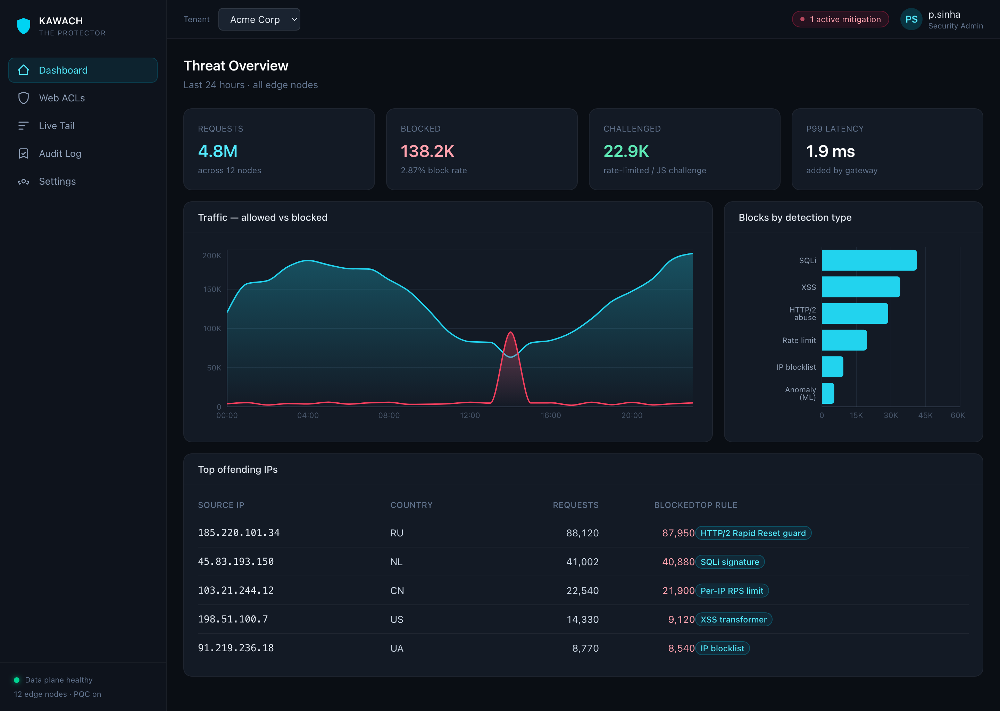
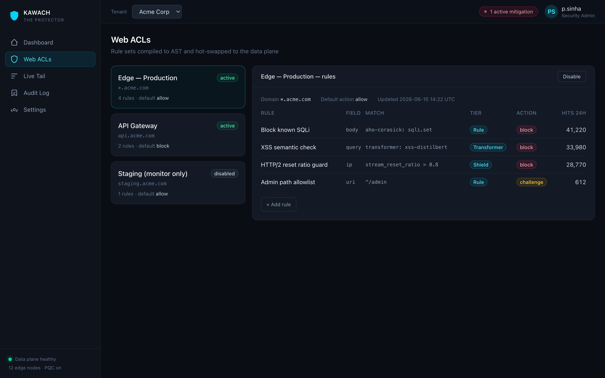
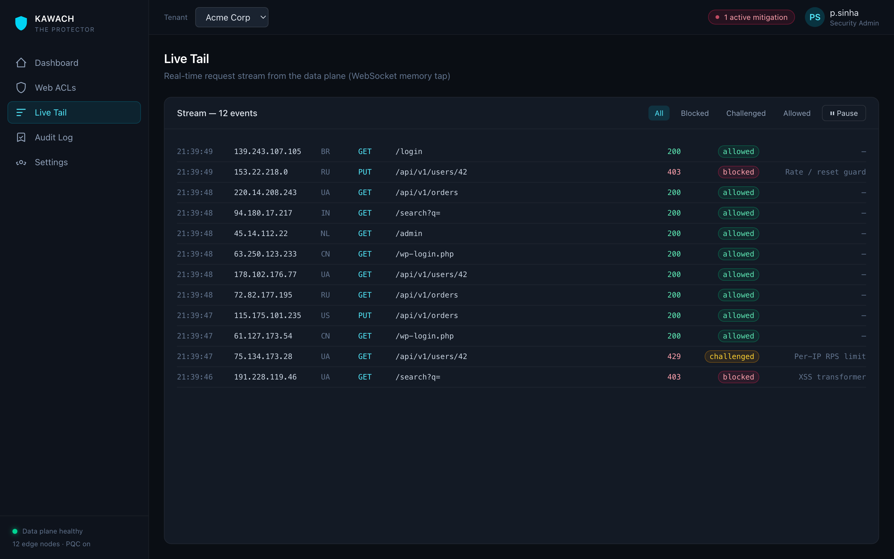

<div align="center">

# 🛡️ Kawach — The Protector

**A high-performance, self-hostable security gateway: multi-tenant L3/4 DDoS mitigation + L7 WAF.**

A modern alternative to AWS Shield + WAF — built in Rust for bare-metal speed, paired with a React control plane.

[](https://www.apache.org/licenses/LICENSE-2.0)


</div>

---

## Why Kawach

The big-cloud edges (Cloudflare, Akamai) win at planetary scale. Kawach competes where they're weak for teams that need to **own their perimeter**:

- **🔒 Zero data egress** — ML inference and TLS termination happen on *your* edge nodes. Sensitive request payloads never leave the cluster.
- **🔮 Post-quantum by default** — hybrid `X25519MLKEM768` key exchange via `rustls`, defending against harvest-now-decrypt-later. Almost no self-hostable WAF ships this.
- **🧠 Adversarially-robust ML** — detection ML is a *defense-in-depth tier* with a mandatory evasion-eval gate, not an evadable front line.
- **⚡ Flat latency under attack** — Rust + thread-per-core (Pingora), no GC pauses during volumetric floods.

---

## The Control Plane

A multi-tenant security console — real-time threat analytics, rule management, and a live request stream.

<div align="center">



<table>
<tr>
<td></td>
<td></td>
</tr>
<tr>
<td align="center"><b>Web ACLs</b> — rules compiled to AST &amp; hot-swapped to the data plane</td>
<td align="center"><b>Live Tail</b> — real-time request stream with WAF verdicts</td>
</tr>
</table>

</div>

---

## Architecture

| Layer | What it does | Tech |
|---|---|---|
| **Data plane** | Reverse-proxy spine, WAF (Aho-Corasick + regex over zero-copy normalized bytes), Shield (rate/connection limits, eBPF/XDP), HTTP/2 abuse guardian, local ML tiers | Rust, [Pingora](https://github.com/cloudflare/pingora), `aya` |
| **Cryptography** | rustls TLS termination, **post-quantum by default**, dynamic SNI, mTLS to upstreams | `rustls` |
| **Control plane** | Multi-tenant RBAC (Postgres RLS), ACL authoring, config sync | React + TS, PostgreSQL |
| **Telemetry** | Async micro-batched events → OLAP, WebSocket live tail, immutable audit trail | ClickHouse, Redis |

Rule sets are authored in the control plane, published over a Pub/Sub bus, compiled to an AST in the data plane, and **Arc-swapped atomically** — config changes apply with zero dropped connections.

---

## Running the application

**Prerequisites:** Rust (stable) + `cmake`, and Node.js 20+.

**Data plane** — the WAF + Shield gateway:

```bash
git clone https://github.com/kawach-security/kawach-dataplane && cd kawach-dataplane
cargo run                       # listens on 0.0.0.0:8080, loads ./acls.json

# Try it (ACL bound to *.acme.com in the sample config):
curl -i -H 'Host: app.acme.com' 'http://localhost:8080/search?q=%27%20OR%201%3D1'
#   -> HTTP/1.1 403  +  X-Kawach-Action: block          (SQLi blocked)
for i in $(seq 1 6); do curl -s -o /dev/null -w '%{http_code} ' \
  -H 'Host: app.acme.com' 'http://localhost:8080/search?q=hi'; done; echo
#   -> 403 403 403 403 403 429                           (rate-limited on the 6th)
```

Edit `acls.json` while it runs — rules and rate limits hot-swap within ~2s, no
restart. Point elsewhere with `KAWACH_ACL_FILE=/path/to/acls.json`.

**Control plane** — the React dashboard:

```bash
git clone https://github.com/kawach-security/kawach-control && cd kawach-control/web
npm install && npm run dev      # http://localhost:5173
```

> The dashboard currently runs against a mock API mirroring the `kawach-proto`
> contracts; the backend API lands in a later phase.

**On Kubernetes** — Docker images + a configurable Helm chart ([`kawach-infra`](https://github.com/kawach-security/kawach-infra)):

```bash
helm install kawach ./charts/kawach          # gateway + dashboard + bundled Redis
helm install kawach ./charts/kawach \        # tune anything via values
  --set dataplane.autoscaling.enabled=true \
  --set redis.deploy=false --set redis.url=redis://my-redis:6379
```

Replicas/HPA, service type, ingress, eBPF privileges, the Redis rate-limit tier,
and the WAF/rate-limit rules (a hot-reloaded ConfigMap) are all configurable.

## Repositories

Start at the umbrella repo — it aggregates everything as submodules:

```bash
git clone --recurse-submodules https://github.com/kawach-security/kawach.git
```

| Repo | Description |
|---|---|
| [`kawach`](https://github.com/kawach-security/kawach) | **Umbrella** — all components as submodules (one clone) |
| [`kawach-dataplane`](https://github.com/kawach-security/kawach-dataplane) | Pingora-based WAF + Shield engine (the hot path) |
| [`kawach-control`](https://github.com/kawach-security/kawach-control) | Control-plane API + React dashboard |
| [`kawach-proto`](https://github.com/kawach-security/kawach-proto) | Shared contracts: ACL schema, config-sync envelope, telemetry events |
| [`kawach-infra`](https://github.com/kawach-security/kawach-infra) | Docker images + configurable Helm chart for Kubernetes |

---

## Built on current research

Kawach's design is grounded in recent (2023–2026) security research rather than convention:

**DDoS & protocol abuse**
- HTTP/2 *Rapid Reset* (CVE-2023-44487) — [Cloudflare technical breakdown](https://blog.cloudflare.com/technical-breakdown-http2-rapid-reset-ddos-attack/)
- *Made You Reset* (CVE-2025-8671), targeting HTTP/2 proxies — [Tempesta analysis](https://tempesta-tech.com/blog/made-you-reset-http2-ddos-attack-analysis-and-mitigation/)
- eBPF/XDP real-time DDoS mitigation — [arXiv:2508.00851](https://arxiv.org/abs/2508.00851); Maglev hashing in eBPF — [analysis](https://blog.joshdow.ca/the-mathematics-of-maglev/)

**ML-WAF & adversarial robustness**
- *WAF-A-MoLE*: evading WAFs via adversarial ML — [arXiv:2001.01952](https://arxiv.org/pdf/2001.01952) (why ML is a *tier*, not the front line)
- Adaptive dual-layer / transformer WAF — [arXiv:2511.12643](https://arxiv.org/abs/2511.12643)
- Zero-day web attacks via LSTM/GRU/autoencoder ensemble — [arXiv:2504.14122](https://arxiv.org/pdf/2504.14122)
- Ensemble adversarial defense for IDS — [Nature Sci. Reports](https://www.nature.com/articles/s41598-025-94023-z); *SAGE* — [arXiv:2509.08091](https://arxiv.org/pdf/2509.08091)

**Cryptography & runtime**
- Post-quantum TLS (`X25519MLKEM768`) in rustls — [docs](https://docs.rs/rustls-post-quantum/latest/rustls_post_quantum/)
- Pingora: Rust proxy at 40M+ rps — [Cloudflare](https://github.com/cloudflare/pingora)

---

## License

Licensed under the **Apache License, Version 2.0**. See [`LICENSE`](LICENSE).
